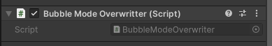
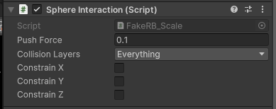
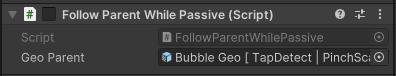
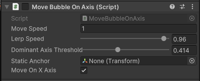
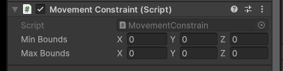
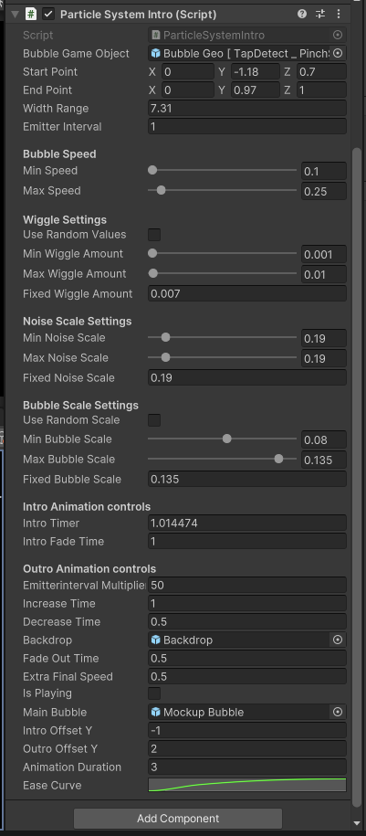
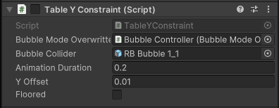

# BubbleModeOverwritter

  

## File Information
- **File Name**: BubbleModeOverwritter.cs
- **Location**: *Devs*/Daniel/Scripts

### Description
This script overrides the mode of a bubble to ensure it works with the MoveOnAxis functionality. It forces the bubble into Placement mode when enabled and reverts it to Free mode when disabled.

### Main Functions
- `SetPlacementMode(bool enable)`: Sets the bubble's mode to Placement or Free based on the input.

### Usage
Attached to bubble GameObjects in the Infinite Canvas chapter to control their interaction mode.

### Notes
- Requires a `BubbleController` component on the same GameObject.
- Automatically sets Placement mode on enable and Free mode on disable (THIS IS IMPORTANT TO NOTE SINCE IMPACTS OTHER PARTS OF THE PROJECT)

### Reason for Creation
This script was created to force a change in the current mode of a bubble. It was required because the mode was previously controlled by another script. Since the Infinite Canvas chapter has a different way of interacting with bubbles, this simple script was necessary to implement the new interaction method.

--- 

# SphereInteraction (Fake RB physics)

  

## File Information
- **File Name**: SphereInteraction.cs
- **Location**: *Devs*/Daniel/Scripts

### Description
This script simulates a simplified physics interaction for spheres without using Unity's built-in Rigidbody system. It allows for controlled pushing of other objects when they come into contact with the sphere, with the ability to constrain movement along specific axes.

### Main Functions
- `CheckCollisionsAndPush()`: Checks for collisions within the sphere's radius and initiates pushing of other objects.
- `PushObject(GameObject objToPush)`: Calculates and applies the push force to a colliding object, respecting axis constraints and movement bounds.
- `ClampPosition(Vector3 position, Vector3 minBounds, Vector3 maxBounds)`: Ensures the pushed object stays within defined boundaries.

### Usage
Attached to bubble GameObjects in the Infinite Canvas chapter, particularly for bubble particles, to control their interactions without having to add a RB component.

### Notes
- Requires a SphereCollider component on the same GameObject.
- Can be used with or without a Rigidbody component.
- Allows for axis-specific movement constraints ✨

### Reason for Creation

This script was created to provide more controlled interactions between bubbles in the Infinite Canvas chapter. It was necessary because full physics simulation with Rigidbodies would result in unpredictable movements. This custom solution allows for precise control over how bubbles interact and move when they come into contact with each other, ensuring they behave as desired within the constraints of the Infinite Canvas feature.

--- 
# FollowParentWhilePassive

  

### File Information
- **File Name**: FollowParentWhilePassive.cs
- **Location**: *Devs*/Daniel/Scripts

### Description
This script ensures that the target object (controlled by the user) follows its parent (mesh/collider) when not actively being interacted with. It prevents position jumps when the object becomes active again after being moved passively.

### Main Functions
- `LateUpdate()`: Updates the position of the target object to match its parent when not actively controlled.
- `SetParent(GameObject newParent)`: Allows manual setting of the parent GameObject for debugging or runtime changes.

### Usage
Attached to the target objects of bubbles in the Infinite Canvas chapter to maintain position consistency when passively moved.

### Notes
- Requires that you set the parent GameObject, that is the collider/mesh.
- Works in conjunction with the MoveBubbleOnAxis component (I think it will even create a component for you if you add this to the GO.)

### Reason for Creation
This script was created to solve a specific issue in the bubble interaction system. When a user was controlling one bubble and pushed another, the mesh and collider of the passive bubble would move, but its target object (used for user control) would remain stationary. This caused a sudden jump in position when the user later interacted with the previously passive bubble. By implementing this script, the target object now follows its parent mesh/collider even when not actively controlled, ensuring smooth transitions between passive and active states.

---

# InfiniteCanvasMoveOnAxis (*DEPRECATED*.)
(this was used in the older version of the scene. the official one is moveOnAxis)

### File Information
- **File Name**: InfiniteCanvasMoveOnAxis.cs
- **Location**: *Devs*/Daniel/Scripts

### Description
This script is the cornerstone of the Infinite Canvas chapter's unique bubble interaction system. It provides a sophisticated method for constraining bubble movement to specific axes based on user input, creating an intuitive and controlled 3D interaction experience.

### Key Components
1. **LeanDragTranslateOnAxes**: A component from the Lean Touch asset, responsible for handling touch input and translating it into movement.
2. **LocalPositionConstrain**: A custom component that applies constraints to the object's local position.

### Usage
Attach this script to bubble GameObjects in the Infinite Canvas chapter.

### Notes
- Requires the Lean Touch asset for touch input handling.

### Reason for Creation
This script was developed to implement a crucial interaction mechanic in the Infinite Canvas chapter. It solves the challenge of providing intuitive 3D object manipulation on a 2D touch screen. By dynamically constraining movement to the most appropriate axis based on user input, it creates a user-friendly way to interact with 3D objects in a complex space. This approach allows users to move bubbles with precision along specific axes, enhancing the overall user experience and interaction fidelity of the AR application.

---

# MoveBubbleOnAxis (*OFFICIAL CODE*)

  

### File Information
- **File Name**: MoveBubbleOnAxis.cs
- **Location**: *Devs*/Daniel/Scripts

### Description
The star of the show! This script is the cornerstone of the Infinite Canvas chapter's bubble interaction system. It provides a method for moving bubbles along specific axes based on the predominant movement from user input.

### Key Components
1. **LeanTouch**: Utilizes the Lean Touch asset for handling touch inputs.
2. **Static Anchor**: A reference point in the scene used to align movement with the AR world space.

### Main Properties
- `moveSpeed`: Multiplier for object movement speed. this is public
- `lerpSpeed`: Controls the smoothness of movement (0-1 range).this is public
- `dominantAxisThreshold`: Determines how much movement is needed to switch axes (0-1 range). this is public
- `staticAnchor`: Reference to the Static Anchor object in the scene. this is public
- `moveOnXAxis`: Boolean to track whether movement is currently on the X or Y axis. this is public

### Main Functions
- `OnEnable()`: Initializes necessary components and finds the Static Anchor.
- `OnSelected(LeanSelect select)`: Handles the selection of the bubble. (you need to add both)
- `OnDeselected(LeanSelect select)`: Handles the deselection of the bubble.(you need to add both)
- `CalculateWorldDelta(Vector2 currentScreenPos, Vector2 lastScreenPos)`: Calculates the world space movement based on screen space input.

### Detailed Functionality

1. **Initialization and Setup**:
   - On enable, the script finds the main camera and the Static Anchor object.
   - It sets up initial positions and ensures all necessary references are in place.

2. **Touch Input Handling**:
   - Uses LeanTouch to detect and process touch inputs.
   - Tracks the last screen position of the touch for delta calculations.

3. **Axis Detection and Constraint**:
   - Implements a sophisticated system to determine the dominant axis of movement.
   - Uses `dominantAxisThreshold` to decide when to switch between X and Y axis movement.
   - This creates a "sticky" axis effect, where slight deviations don't cause unwanted axis switches.

4. **Movement Calculation**:
   - Converts screen space movement to world space using `CalculateWorldDelta()`.
   - Transforms the world delta into the Static Anchor's local space for alignment with the AR world.
   - Applies movement constraints based on the detected dominant axis.
   - Transforms the constrained movement back to world space for application.

5. **Smooth Movement Application**:
   - Uses Vector3.Lerp to smoothly interpolate the bubble's position to the target position.
   - The `lerpSpeed` property allows fine-tuning of the movement smoothness.

6. **AR Space Alignment**:
   - NEW! Utilizes the Static Anchor to ensure movement aligns correctly with the AR world space.
   - This is crucial for maintaining proper spatial relationships in the AVP anchor.

7. **Selection Handling**:
   - Implements `OnSelected()` and `OnDeselected()` methods to manage the bubble's interactive state.
   - These methods are compatible with both LeanTouch events and manual calls.

### Usage
Attach this script to bubble GameObjects in the Infinite Canvas chapter. It works in conjunction with the LeanTouch system to create the core interaction mechanic of the Infinite Canvas feature.

### Notes
- Requires the Lean Touch asset for touch input handling.
- The `staticAnchor` object is crucial for proper alignment!!!! Ensure it's properly set up in the scene before run this.

### Reason for Creation
without this, there wouldn't be a chapter.

By dynamically constraining movement to the most appropriate axis based on user input, it creates a user-friendly way to interact with 3D objects in a complex AR space. This approach allows users to move bubbles with precision, enhancing the overall user experience and interaction fidelity of the AR application.

---

# MovementConstraint

  

### File Information
- **File Name**: MovementConstraint.cs
- **Location**: *Devs*/Daniel/Scripts

### Description
This script implements a system to constrain the movement of bubbles within a defined 3D space in this chapter... It creates invisible boundaries based on the positions of reference objects in the scene, ensuring that the bubbles remain within a specified area. Currently it's set to infinite.

### Key Components
1. **Reference Objects**: WallLeft, WallRight, and Ceiling objects in the scene that define the boundaries.
2. **Movement Rooms**: Calculated spaces that determine how far the object can move in each direction.
3. **Bounds**: Minimum and maximum coordinates within which the object is allowed to move.

### Main Properties
- `roomToMovePositive`: Vector3 representing the positive space the object can move in each axis.
- `roomToMoveNegative`: Vector3 representing the negative space the object can move in each axis.
- `minBounds` and `maxBounds`: Vector3s defining the minimum and maximum positions the object can occupy.

### Main Functions
- `Start()`: Initializes the constraint system by finding reference objects and calculating bounds.
- `Update()`: Continuously applies position constraints (this is required because the position changes, with the tracker, the avp)
- `FindReferenceObjects()`: Locates the necessary boundary objects in the scene.
- `CalculateMovementRooms()`: Determines the available movement space based on the object's start position and reference objects.
- `CalculateBounds()`: Computes the minimum and maximum bounds for movement.
- `ConstrainPosition()`: Applies the calculated constraints to the object's position.
- `CalculateRoom()`: Public method to recalculate constraints, useful for runtime updates.

### Usage
Attach this script to bubble GameObjects AND IMPORTANT: Ensure that the reference objects (WallLeft, WallRight, Ceiling) are present and correctly named in the scene.

### Notes
- *The script assumes a specific scene setup with named reference objects.* Ensure these are present and correctly named.

---
# ObjectRotator

### File Information
- **File Name**: ObjectRotator.cs
- **Location**: *Devs*/Daniel/Scripts

### Description
This script provides a subtle, randomized rotation effect for objects (specifically bubbles) in the Infinite Canvas chapter. It's designed to add a visual flourish when a bubble transforms into a cube upon user interaction, enhancing the overall user experience with smooth, decelerating rotations.

### Key Components
1. **Rotation Trigger**: A boolean flag to initiate rotation.
2. **Randomized Rotation**: Uses a random axis for unpredictable, varied rotations.
3. **Smooth Deceleration**: Gradually slows down the rotation for a natural, physics-like effect.

### Main Properties
- `Rotate`: Boolean flag to trigger the rotation effect.
- `MaxRotationSpeed`: The initial speed of rotation in degrees per second.
- `DecelerationRate`: The rate at which the rotation slows down over time.

### Private Variables
- `rotationAxis`: A randomly generated Vector3 that determines the axis of rotation.
- `currentRotationSpeed`: Tracks the current speed of rotation, which decreases over time.

1. **Initiating Rotation**:
   - When `Rotate` is set to true and the object isn't already rotating, it:
     - Generates a random rotation axis.
     - Sets the rotation speed to the maximum.
     - Resets the `Rotate` flag to false.

2. **Applying and Decelerating Rotation**:
   - If the current rotation speed is greater than zero:
     - Applies rotation to the object around the random axis.
     - Decreases the rotation speed based on the deceleration rate.
     - Ensures the rotation speed never goes below zero.

### Usage
Attach this script to bubble GameObjects (or any other object that you want to spin around). To trigger a rotation:
1. Ensure the script is enabled on the object.
2. Set the `Rotate` property to `true` (e.g., I use this when bubble transforms into a cube. btw, there's a public toggle in the editor to use).
3. The script will handle the rest, creating a smooth, decelerating rotation effect.

## Reason for Creation
This script was developed to add a dynamic effect to the user interaction when the bubble becomes a cube.

---
# ParticleSystemIntro

  

### File Information
- **File Name**: ParticleSystemIntro.cs
- **Location**: *Devs*/Daniel/Scripts

### Description
This script implements a custom particle system for creating dynamic bubble animations in the Infinite Canvas chapter. It manages the spawning, movement, and lifecycle of bubble particles, as well as intro and outro animations for the entire system.

### Key Components
1. **Bubble Spawning**: Generates bubble objects at specified intervals.
2. **Particle Movement**: Controls the upward movement and wiggle effect of bubbles.
3. **Intro/Outro Animations**: Manages fade-in and fade-out effects for the backdrop and special animations for a main bubble.
4. **Dynamic Parameter Control**: Allows for randomized or fixed values for bubble properties.

### Main Properties
- `BubbleGameObject`: Prefab for individual bubbles.
- `startPoint` and `endPoint`: Define the spawn and despawn positions for bubbles.
- `EmitterInterval`: Controls the rate of bubble spawning.
- Various range properties for speed, wiggle, noise, and scale of bubbles.
- Animation control properties for intro and outro effects.

### Main Functions
- `Start()`: Initializes the system and sets up the main bubble.
- `Update()`: Handles continuous spawning of bubbles and manages intro/outro animations.
- `SpawnBubble()`: Creates a new bubble with randomized properties.
- `PlayIntro()` and `PlayOutro()`: Trigger the intro and outro animations respectively.
- `AnimateMainBubble()`: Handles the animation of the main featured bubble.

### Detailed Functionality

1. **Bubble Spawning and Movement**:
   - Bubbles are spawned at regular intervals defined by `EmitterInterval`.
   - Each bubble's movement is controlled by the `BubbleTracker` component, which is dynamically added.
   - Bubbles move upwards with a combination of linear movement, sine wave wiggle, and Perlin noise (GOOD LUCK CHANGING THIS!)

2. **Intro Animation**:
   - Mostly for the main bubble and the backdrop...
   - Fades in the backdrop material.
   - Animates the main bubble into position.
   - Gradually starts the bubble spawning process.

3. **Outro Animation**:
   - Increases bubble speed and spawn rate.
   - Fades out the backdrop.
   - Animates the main bubble out of the scene.

4. **Main Bubble Animation**:
   - Separate control for a featured main bubble.
   - Smooth animation using an ease curve for intro and outro movements.

5. **Gizmo Visualization**:
   - Provides visual aids in the Unity editor for start and end points of the bubble path.

6. **Child System Control**:
   - Can trigger intro/outro animations on child ParticleSystemIntro components.

### BubbleTracker Class
This is a custom script that is dynamicaly generate to be attached to each bubble.

- Manages individual bubble movement, including upward motion and wiggle effects.
- Handles bubble destruction when it reaches the end point.

### Notes
- The script is highly customizable through the inspector. so you won't need to look the ugliness that is the script.
-You don't need to add a main bubble of backdrop. so if you want more bubbles, like what I'm doing with the small bubbles, you can :)

---
# RenameTarget

### File Information
- **File Name**: RenameTarget.cs
- **Location**: *Devs*/Daniel/Scripts

### Description
This script is a utility tool designed to rename child objects based on their parent's name. It's specifically used to rename 'target physics' objects in the Infinite Canvas chapter, ensuring they maintain a connection to their original parent through naming convention even after being detached at runtime.

### Key Components
1. **Automatic Renaming**: Triggers on object enable.
2. **Parent Name Extraction**: Uses the last 3 characters of the parent's name or the full name if shorter.
3. **Child Renaming**: Appends the parent's name suffix to each child object.

### Main Functions
- `OnEnable()`: Automatically calls the renaming function when the object becomes active.
- `RenameChildren()`: Core function that performs the renaming logic on all child objects.

### Reason for Creation
Just to help debug and track objects around, dugin runtime.

---

# ShapeTransformer

### File Information
- **File Name**: ShapeTransformer.cs
- **Location**: *Devs*/Daniel/Scripts
- **Namespace**: Buck.Framework

### Description
This script manages the transformation of an object between sphere and cube shapes using blend shapes. It provides smooth transitions between these states and can optionally trigger a rotation effect after transformation.

### Key Components
1. **BlendShapeControl**: Required component for manipulating blend shapes.
2. **ObjectRotator**: Required component for adding rotation effects.
3. **Coroutine-based Animation**: Smooth transitions between shapes.
4. **Toggle Functionality**: Allows for easy switching between cube and sphere states.

### Main Properties
- `cubeShapeIndex`: Index of the cube blend shape (default: 1).
- `cubeTransformTime`: Duration of the transformation to cube.
- `sphereTransformTime`: Duration of the transformation to sphere.
- `willRotate`: Flag to determine if rotation should be applied after cube transformation.

### Main Functions
- `TransformIntoCube()`: Initiates the transformation to a cube shape.
- `TransformIntoSphere()`: Initiates the transformation to a sphere shape.
- `ToggleTransform()`: Switches between cube and sphere shapes.

### Detailed Functionality

1. **Initialization**:
   - On Start, retrieves references to BlendShapeControl and ObjectRotator components.

2. **Shape Transformation**:
   - Uses coroutines to smoothly animate between shape states.
   - Lerps the blend shape weight from start to end value over a specified duration.
   - For cube transformation, can optionally trigger rotation at the end.

3. **Toggle Mechanism**:
   - Keeps track of current shape state (cube or sphere).
   - Allows for easy switching between states with a single method call.

4. **Rotation Integration**:
   - After transforming into a cube, can activate the ObjectRotator for additional visual effect.

### Usage
Attach this script to objects in the Infinite Canvas chapter that need to transform between sphere and cube shapes. Ensure the object has BlendShapeControl and ObjectRotator components.

### Notes
- Requires a mesh with appropriate blend shapes set up for cube transformation.
- The cube shape is assumed to be at index 1 in the blend shapes, but this can be adjusted in the inspector.
- Performance consideration: Blend shape animations are generally efficient, but be mindful when using on many objects simultaneously.

### Reason for Creation
This script was developed to enhance the visual interactivity of objects in the Infinite Canvas chapter:
1. It provides a smooth, visually appealing transition between sphere and cube states.
2. The transformation serves as a clear visual indicator of object state or user interaction.
3. Integration with rotation adds an extra layer of visual feedback, enhancing the user experience.
4. The toggle functionality allows for easy implementation of interactive elements that can switch between two distinct visual states.

By implementing this shape transformation system, the script adds a dynamic and engaging visual element to the AR application, allowing for more intuitive and visually interesting interactions within the Infinite Canvas feature.

---

# TableYConstraint

  

### File Information
- **File Name**: TableYConstraint.cs
- **Location**: *Devs*/Daniel/Scripts

### Description
This script prevents bubbles from passing through the table surface in the Infinite Canvas chapter. It constrains the Y-axis movement of bubbles and provides a smooth animation when a bubble reaches the table's surface.

### Key Components
1. **Y-Axis Movement Constraint**: Prevents bubbles from going below a certain Y threshold.
2. **Smooth Animation**: Gently moves the bubble up when it contacts the table surface.
3. **Integration with Other Scripts**: Works with MoveBubbleOnAxis and BubbleModeOverwritter for comprehensive behavior control.

### Main Properties
- `BubbleModeOverwritter`: Reference to the BubbleModeOverwritter script.
- `BubbleCollider`: GameObject representing the bubble's collider.
- `AnimationDuration`: Duration of the upward animation when contacting the table.
- `YOffset`: The amount to move the bubble up when it contacts the table.

### Main Functions
- `Update()`: Continuously checks the bubble's position relative to the table surface.
- `AnimateYPosition()`: Coroutine that smoothly animates the bubble's position when it contacts the table.

### Detailed Functionality

1. **Initialization**:
   - Finds and stores references to necessary components and game objects.
   - Logs errors if critical components or objects are missing.

2. **Continuous Position Checking**:
   - In the Update method, constantly monitors the bubble's Y position relative to the static anchor (representing the table surface).
   - Detects when the bubble goes below a certain threshold above the table surface.

3. **Table Contact Handling**:
   - When the bubble contacts the table:
     - Disables the MoveBubbleOnAxis component.
     - Sets the bubble to non-placement mode via BubbleModeOverwritter.
     - Initiates the upward animation.
     - Disables the FollowParentWhilePassive component.
     - Sets a 'floored' flag to true.

4. **Smooth Upward Animation**:
   - Uses a coroutine to smoothly interpolate the bubble's position upwards.
   - Applies the animation to both the bubble collider and its transform.
   - Ensures the final position is exactly as intended.

5. **Reset Behavior**:
   - When the bubble moves above the threshold, resets the 'floored' flag and re-enables FollowParentWhilePassive.

### Usage
Attach this script to bubble objects in the Infinite Canvas chapter that need to interact with the table surface. Ensure all referenced components and game objects are properly set up in the Unity Inspector.

### Notes
- Requires a properly set up "ChildAnchor" object in the scene to represent the table surface.
- The script assumes a specific setup with MoveBubbleOnAxis, BubbleModeOverwritter, and FollowParentWhilePassive components.
- The Y threshold for table contact is hardcoded (staticAnchor.position.y + 0.09f). Consider making this configurable if needed.

### Reason for Creation
This script was developed to solve specific challenges in the Infinite Canvas chapter:
1. It prevents the unrealistic behavior of bubbles passing through the virtual table surface.
2. Provides a smooth, visually pleasing interaction when bubbles contact the table.
3. Integrates with other bubble control scripts to ensure consistent behavior across different states.
4. Enhances the overall realism and user experience of the AR application by respecting virtual physical boundaries.

By implementing this Y-axis constraint and smooth animation system, the script contributes to a more immersive and physically believable AR environment in the Infinite Canvas feature.
